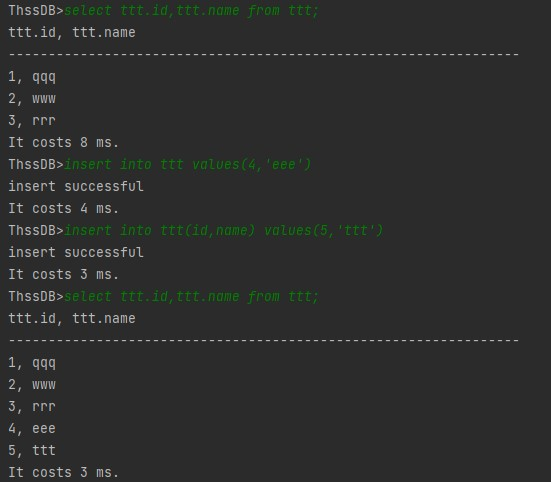
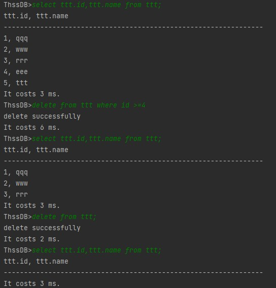
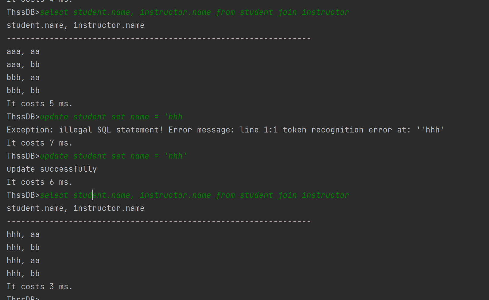
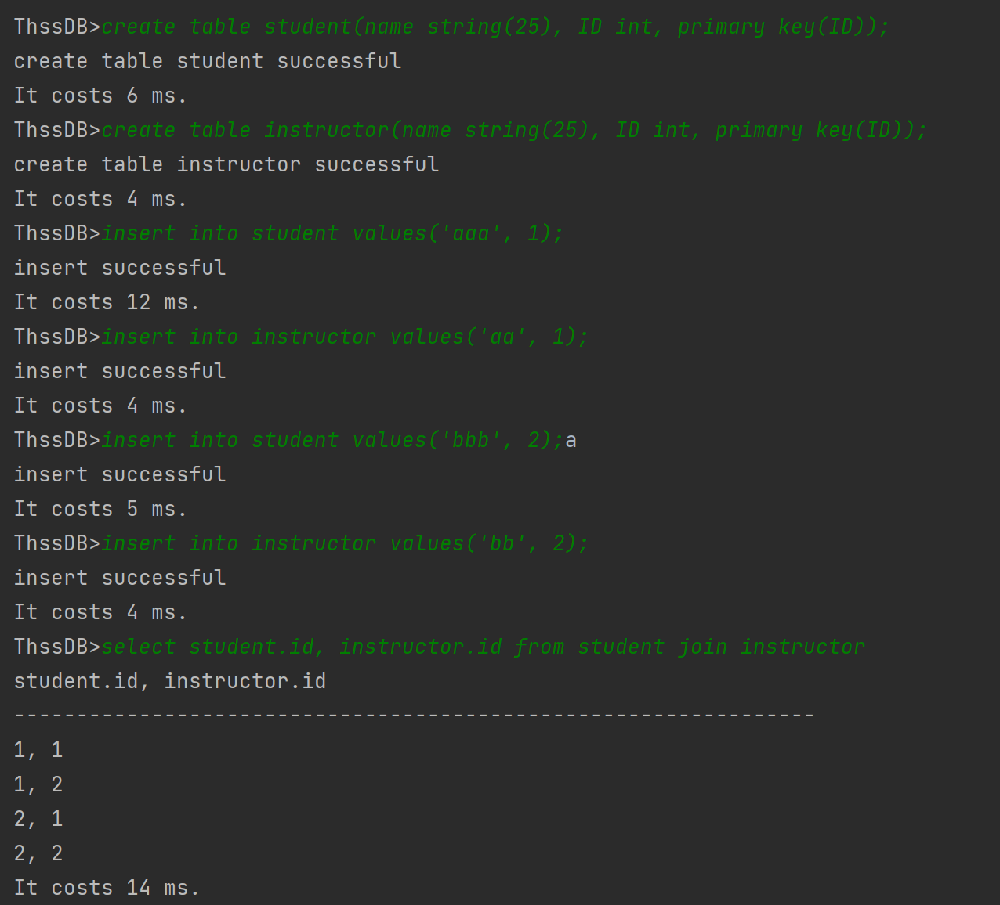
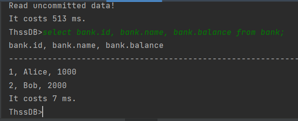
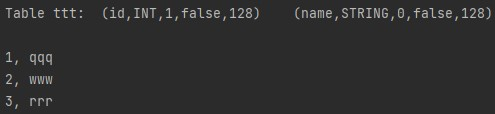

# thssdb report

## 查询模块

### CREATE TABLE

* 功能演示

  ```sql
  CREATE TABLE person (name String(256), ID Int not null, PRIMARY KEY(ID))
  ```

  

* 实现方法

  修改`impVisitor.java`文件的`visitCreate_table_stmt`函数。

  首先通过`ctx.table_name()`获取表的名字，然后创建一个新的`Column`ArrayList，使用`ctx.getChild(i)`语句对每个数据项或主键进行分析，如果是数据项，提取`ColumnName`和`typeName`(长度: 默认128)，对该数据项的约束进行分析，记录是否有`NOT NULL`约束。扫描完元数据的信息后调用`new Column(columnName, type, 0, notNull, length)`将该Column的信息加入到ArrayList中。最后如果是主键约束，从ArrayList中扫描所有Column，将该Column的主键改为1。

  最后将ArrayList转为Column数组，调用`GetCurrentDB().create(tablename, columns)`成功创建table，返回创建成功的信息。

### DROP TABLE

* 功能演示

  ```sql
  DROP TABLE person;
  ```

  

* 实现方法

  修改`impVisitor.java`文件的`visitDrop_table_stmt`函数。

  在try语句块中调用

  ```java
  GetCurrentDB().drop(ctx.table_name().getText().toLowerCase());
  ```

### SHOW TABLE

* 功能演示：见CREATE TABLE

  ```sql
  SHOW TABLE person;
  ```

* 实现方法

  修改`impVisitor.java`文件的`visitShow_meta_stmt`函数。

  每一行展示一个字段的信息。

  首先获取表名，然后对于每个Column, 调用`column.getColumnName()`和`column.getColumnType()`获取Column的名字和type, `column.getMaxLength()`获取最大长度。然后通过`columns.get(i).isPrimary()`和`columns.get(i).cantBeNull()`判断该column的约束，最后返回上述metadata结果。

### INSERT

* 功能演示：

  

* 实现原理：

  从sql语句中解析出`tableName,columnName,values`；

  若`columnName`为空，则首先获取当前表的所有列`columns`，再依据`values`和对应列构造Cell列表`cells`，之后利用`cells`构造Row并调用`insert`函数插入列；

  若`columnName`不为空，则首先在`columns`中找到对应列，之后过程同上构造Row并插入。

### DELETE

* 功能演示

  

* 实现原理

  从sql语句中解析出`tableName`,若包含`K_WHERE`则再解析`attrName,attrName`

  若不包含where关键词，则依次对当前表每一行调用`delete`删除。

  若包含where关键词，则找到列中对应`attrName`的index，构造`comparator`并依据此依次检查当前表每一行的对应元素是否满足where条件，对满足的行调用`delete`删除。

### UPDATE 
   - 功能演示：

  ```sql
  UPDATE  tableName  SET  attrName = attrValue  WHERE  attrName = attrValue
  ```

  


- 实现方法

  修改`impVisitor.java`文件的`visitUpdate_stmt`函数。
  首先获取表名并拿到对应的表，根据UPDATE后面的WHERE字句，从列信息中找到表中对应的属性，并将WHERE子句等号右边的值转化为对应的类型。然后将每一行里这个属性的值与其作比较，来筛选出表中符合条件的行。最后对每一行都调用`table.update`来更新这一行。


### SELECT

   * 功能演示：


```sql
  SELECT tableName1.AttrName1, tableName1.AttrName2…, tableName2.AttrName1, tableName2.AttrName2,…  FROM  tableName1 [JOIN tableName2 [ON  tableName1.attrName1 = tableName2.attrName2]] [ WHERE  attrName1 = attrValue ]
```

  

  * 实现方法

    定义`QueryTable`来保存查询中途的表的行列信息，同时实现`QueryTable·`之间的Join。

    修改`impVisitor.java`文件的`visitSelect_stmt`函数。
  
    先处理FROM字句，拿到对应的QueryTable，
    
    处理方法为：
    
    - 若有至少一个Join，就将最后一个Join前面的部分递归处理，然后将处理结果与最后一个join后面的表名对应的QueryTable进行join。
    - 否则，只剩下一个表名需要处理，返回它对应的QueryTable
  - 注意，利用一个表名得到对应的QueryTable时，会将表名加在列信息里每个属性的前面。
    
    因此当前的SELECT语句是可以支持多个JOIN的。
    
    
    
    接下来处理WHERE子句，即从原来的QueryTable中筛选出一些行，得到一个新的QueryTable。
    
    处理方法为：利用与Update中相同的方法筛选出刚才拿到的QueryTable中满足条件的所有行。
    
    
    
    最后处理SELECT子句，即从原来的QueryTable中筛选出一些列，得到一个新的QueryTable。
    
    处理方法为：得到每个最终要查询的属性在之前的QueryTable中对应的索引。然后对每一行，筛选出这些索引对应的列即可。
    
    
    
    处理完后，将结果保存至QueryResult里。


## 事务模块

### READ COMMITTED

* 功能演示

  ```sql
  create table bank(id int, name String(256) NOT NULL, balance int NOT NULL, PRIMARY KEY(id));
  insert into bank values(1, 'Alice', 2000);
  insert into bank values(2, 'Bob', 2000);
  select bank.id, bank.name, bank.balance from bank;
  ```
  
  

  开两个客户端A, B:

  客户端A:

  ```sql
  begin transaction;
  update bank set balance=1000 where name='Alice';
  ```
  
  

  客户端B:

  无法读取uncommitted data。

  ```sql
  select bank.id, bank.name, bank.balance from bank;
  ```
  
  

  客户端A commit

  

  客户端B 可以正确读取 

  
  
   
  
* 实现方法

  首先需要明确的一点是对于`READ COMMITTED`隔离级别，我们需要实现的是严格(strict)的2PL封锁协议。也就是说对于涉及到写操作，我们需要加X-lock, 必须在事务提交后进行释放。对于S-lock没有要求。

  `x_lockDict`记录了session和当前加了x-lock的table 名称列表。

  原本给的框架对于update,insert,delete语句自动执行`begin transaction`和`commit`，对于事务没有支持。我们首先更改了`SQL.g4`加入了对于`BEGIN TRANSACTION`和`COMMIT`的支持。然后使用antlr重新生成相关文件。

  然后修改了`IServiceHandler`的事务开启逻辑：

  ```java
  if ((Arrays.asList(CMD_HEADS).contains(cmd_head.toLowerCase())) && !manager.transaction_sessions.contains(session)) {
          sqlHandler.evaluate("begin transaction", session, false);
          queryResults = sqlHandler.evaluate(statement, session, false);
          sqlHandler.evaluate("commit", session, false);
        } else queryResults = sqlHandler.evaluate(statement, session, false);
  ```

  如上所示，只有当前的session不处于事务状态时才会自动开启事务并在执行完毕后自动提交。

  修改`ImpVisitor`文件，增加了`visitBegin_transaction_stmt`和`visitCommit_stmt`函数：

  * `visitBegin_transaction_stmt`: 将当前的session加入事务session列表，初始化读、写锁HashMap
  * `visitCommit_stmt`: 将当前的session从事务session列表中去除，释放所有X-lock。
  
  对于`visitSelect_stmt`加入对于锁的判断，尝试获取数据项的s-lock, 如果该数据项位于x-lock的hashMap中，则获取读锁失败，会提示用户正在读入uncommitted数据。

### read log

* 功能演示：

  假设数据库`test`的`log`文件如下：

  

  已写入磁盘的数据如下：

  

  启动后查询该表，发现`log`中记录的数据已恢复：

  

* 实现原理：

  为了实现记录不同session的操作，`schema/Manager.writeLog`函数添加参数`session`，以`session@statement`形式记录每条语句。同时为防止在数据库恢复时`log`中写入语句，`parser/SQLHandler.evaluate`函数添加参数`isLog`，在数据库恢复时调用该函数，置`isLog=true`，此时不进行`writeLog`操作。

  `schema/Manager.readLog`首先找到`databaseName`对应数据库的`log`文件，读取文件中每行记录的`session`和`statement`，使用`sqlHandler.evaluate(statement, session, true)`执行每条语句以达到恢复数据库的目的。
