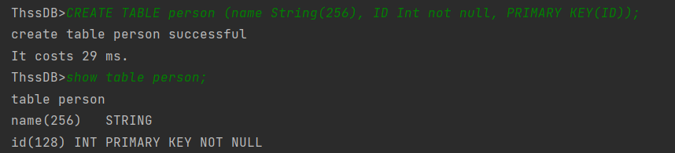
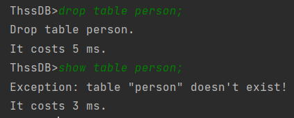

# thssdb report

## 查询模块

* CREATE TABLE

  * 功能演示

    ```sql
    CREATE TABLE person (name String(256), ID Int not null, PRIMARY KEY(ID))
    ```

    

  * 实现方法

    修改`impVisitor.java`文件的`visitCreate_table_stmt`函数。

    首先通过`ctx.table_name()`获取表的名字，然后创建一个新的`Column`ArrayList，使用`ctx.getChild(i)`语句对每个数据项或主键进行分析，如果是数据项，提取`ColumnName`和`typeName`(长度: 默认128)，对该数据项的约束进行分析，记录是否有`NOT NULL`约束。扫描完元数据的信息后调用`new Column(columnName, type, 0, notNull, length)`将该Column的信息加入到ArrayList中。最后如果是主键约束，从ArrayList中扫描所有Column，将该Column的主键改为1。

    最后将ArrayList转为Column数组，调用`GetCurrentDB().create(tablename, columns)`成功创建table，返回创建成功的信息。

* DROP TABLE

  * 功能演示

    ```sql
    DROP TABLE person;
    ```

    

  * 实现方法

    修改`impVisitor.java`文件的`visitDrop_table_stmt`函数。

    在try语句块中调用

    ```java
    GetCurrentDB().drop(ctx.table_name().getText().toLowerCase());
    ```

* SHOW TABLE

  * 功能演示：见CREATE TABLE

    ```sql
    SHOW TABLE person;
    ```

  * 实现方法

    修改`impVisitor.java`文件的`visitShow_meta_stmt`函数。

    每一行展示一个字段的信息。

    首先获取表名，然后对于每个Column, 调用`column.getColumnName()`和`column.getColumnType()`获取Column的名字和type, `column.getMaxLength()`获取最大长度。然后通过`columns.get(i).isPrimary()`和`columns.get(i).cantBeNull()`判断该column的约束，最后返回上述metadata结果。


## 事务模块

* 实现READ COMMITTED隔离级别

  * 功能演示

    准备数据

    ```sql
    create table bank(id int, name String(256) NOT NULL, balance int NOT NULL, PRIMARY KEY(id));
    insert into bank values(1, 'Alice', 2000);
    insert into bank values(2, 'Bob', 2000);
    select bank.id, bank.name, bank.balance from bank;
    ```

    

    开两个客户端A, B:

    客户端A:

    ```sql
    begin transaction;
    update bank set balance=1000 where name='Alice';
    ```

    

    客户端B:

    无法读取uncommitted data。

    ```sql
    select bank.id, bank.name, bank.balance from bank;
    ```

    

    客户端A commit

    

    客户端B 可以正确读取 

  * 实现方法

    首先需要明确的一点是对于`READ COMMITTED`隔离级别，我们需要实现的是严格(strict)的2PL封锁协议。也就是说对于涉及到写操作，我们需要加X-lock, 必须在事务提交后进行释放。对于S-lock没有要求。

    `x_lockDict`记录了session和当前加了x-lock的table 名称列表。

    原本给的框架对于update,insert,delete语句自动执行`begin transaction`和`commit`，对于事务没有支持。我们首先更改了`SQL.g4`加入了对于`BEGIN TRANSACTION`和`COMMIT`的支持。然后使用antlr重新生成相关文件。

    然后修改了`IServiceHandler`的事务开启逻辑：

    ```java
    if ((Arrays.asList(CMD_HEADS).contains(cmd_head.toLowerCase())) && !manager.transaction_sessions.contains(session)) {
            sqlHandler.evaluate("begin transaction", session, false);
            queryResults = sqlHandler.evaluate(statement, session, false);
            sqlHandler.evaluate("commit", session, false);
          } else queryResults = sqlHandler.evaluate(statement, session, false);
    ```

    如上所示，只有当前的session不处于事务状态时才会自动开启事务并在执行完毕后自动提交。

    

    修改`ImpVisitor`文件，增加了`visitBegin_transaction_stmt`和`visitCommit_stmt`函数：

    * `visitBegin_transaction_stmt`: 将当前的session加入事务session列表，初始化读、写锁HashMap
    * `visitCommit_stmt`: 将当前的session从事务session列表中去除，释放所有X-lock。

    对于`visitSelect_stmt`加入对于锁的判断，尝试获取数据项的s-lock, 如果该数据项位于x-lock的hashMap中，则获取读锁失败，会提示用户正在读入uncommitted数据。