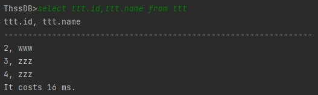

### insert

* 功能演示：
  
  

* 实现原理：
  
  从sql语句中解析出`tableName,columnName,values`；
  
  若`columnName`为空，则首先获取当前表的所有列`columns`，再依据`values`和对应列构造Cell列表`cells`，之后利用`cells`构造Row并调用`insert`函数插入列；
  
  若`columnName`不为空，则首先在`columns`中找到对应列，之后过程同上构造Row并插入。

### delete

* 功能演示
  
  

* 实现原理
  
  从sql语句中解析出`tableName`,若包含`K_WHERE`则再解析`attrName,attrName`
  
  若不包含where关键词，则依次对当前表每一行调用`delete`删除。
  
  若包含where关键词，则找到列中对应`attrName`的index，构造`comparator`并依据此依次检查当前表每一行的对应元素是否满足where条件，对满足的行调用`delete`删除。

### read log

* 功能演示：
  
  假设数据库`test`的`log`文件如下：
  
  
  
  已写入磁盘的数据如下：
  
  
  
  启动后查询该表，发现`log`中记录的数据已恢复：
  
  

* 实现原理：
  
  为了实现记录不同session的操作，`schema/Manager.writeLog`函数添加参数`session`，以`session@statement`形式记录每条语句。同时为防止在数据库恢复时`log`中写入语句，`parser/SQLHandler.evaluate`函数添加参数`isLog`，在数据库恢复时调用该函数，置`isLog=true`，此时不进行`writeLog`操作。
  
  `schema/Manager.readLog`首先找到`databaseName`对应数据库的`log`文件，读取文件中每行记录的`session`和`statement`，使用`sqlHandler.evaluate(statement, session, true)`执行每条语句以达到恢复数据库的目的。

